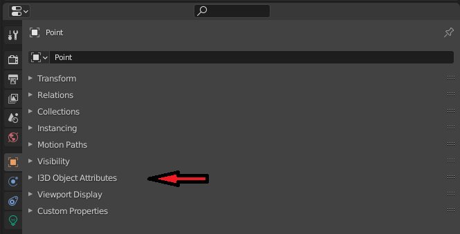
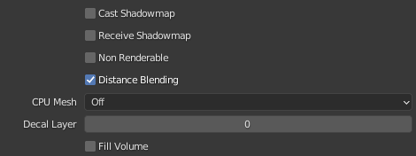

.. _i3d_attributes:

I3D Attributes
==============

The exporter gives you the possibility of managing all of your i3d object attributes directly through the blender
interface, without having to set a single thing inside of Giants Engine. The attributes are laid out in a way to match
GE as closely as possible with respect to naming and the variable ranges possible to set. In some cases the blender
attributes might even impose stricter ranges on certain variables as GE has some inconsistencies with what is shown in
the interface and what gets saved to the i3d file.

.. Note:: Not all attributes have been transferred unto the new system described here yet! Only Light attributes so far.
   Other attributes such as Object attributes follows a model close to what is described as a
   :ref:`Regular Attribute<I3D Regular Attribute>` in the new system.

Where to find them
------------------
The general way that the addon handles attributes is to put them on the object they belong to, in the section in the
`Properties <https://docs.blender.org/manual/en/latest/editors/properties_editor.html>`_ to which they relate. This is
inspired by `this <https://wiki.blender.org/wiki/Reference/Release_Notes/2.80/Python_API/UI_DESIGN>`_ release note
detailing how addon developers should reconsider the <2.80 way of having every single addon as another panel in the
sidebar, which is how the old i3d exporter functioned.

This means that the i3d attributes are spread out across your objects into relevant sections. To make it a bit easier,
to distinguish between which properties are blenders and which belong to the addon, all i3d attributes goes into a panel
called "**I3D <something> Attributes**", where the "something" changes depending on what the attributes relate to.

    In this case we are dealing with *object attributes*, which are the general purpose attributes for all objects.

In general attributes are split into two places. One is the "general purpose" attributes that all nodes in GE has.
They are grouped as "Transform" within GE and we call them "Object Attributes" in Blender. All object types will have
this whether it is a shape(mesh) or a light.

Then the objects also has a data specific group of attributes that depend on which type of object they are. In Blender
the icon for this group of properties changes for each object type, but it is always the green one. The following figure
highlights these two places where you can find the location of the i3d attribute panels.

.. figure:: i3d_attribute_locations.png
    :figclass: align-center

    The red arrow is the property group for the object, where you will find "Transform" specific attributes. The blue
    arrow is where you find object specific attributes. The icon varies depending on which object type you are looking
    at.

Reasoning behind the UI
-----------------------
.. figure:: i3d_attribute_snippet.png

    A snippet from the light attributes showing off the different ui elements

There are essentially three types of attributes to deal with:

1. Things that are already present in Blender and have a direct 1:1 mapping with concepts in GE. *These are things such
   as the name of an object or it's transformation.*

2. Things that vaguely does the same thing in Blender as they do in GE. Sometimes you would want these settings for
   doing nice renders in Blender and also have them exported. And other times you would just have a nice overview with
   the setting named the same as the GE equivalent. *This could be shadow settings or object visibility settings.*

3. Things that aren't possible in Blender or where the GE concept is widely differently implemented. *This could be
   something like which rigidbody type the object is to use.*

The way this is handled in the exporter is that basic attributes that fit the first case are just exported as is.
If you want to change these you have to do it through interactions with the equivalent Blender properties, so e.g.
changing the transform of the object.

The second and third kind of attributes are handled by providing a list of properties that tries to stay as 1:1 as it can
with the UI of GE, this way it should seem familiar to people.
For every attribute that fits under case three it will just be business as usual, but special properties are added to
attributes that fit case two. These properties allow you to either just use the attribute as you normally would or set
it to "track" the built-in Blender property that serves the same function in Blender as the attribute would in GE.

This all might seem like a very convoluted way to do things, but the objective is to provide people with a way in which
they have to do as little duplicate work as possible.
So if you want to setup your scene for a nice render of your FS mod, then you won't need to duplicate object settings
into the i3d attributes. If it is possible to map the Blender properties you have already set. The individual elements
are explained in the next section.

UI Overview
-----------
This section will describe the individual elements of the UI and eg. why some things are greyed out at times.

.. _I3D Regular Attribute:

Regular Attributes
^^^^^^^^^^^^^^^^^^

These work just like any other normal Blender property. You set a value and if it is different from the default value
of that attribute, then it will be exported to the i3d file.

Dependent Attributes
^^^^^^^^^^^^^^^^^^^^
.. figure:: i3d_attribute_dependent.png

   Each of the 'Shadow' attributes are depending on **Cast Shadow Map** being enabled

A dependent attribute will be greyed out in the ui, when it's dependency is not met. If you want to figure out what
you need to enable to get access to the attribute, you can hover over it and read the description. It will provide
a list of the dependent attributes and what their values should be to unlock this attribute.

.. figure:: i3d_attribute_dependent_description.png

   The description of a dependent attribute contains the name(s) of the attribute it depends on along with the value
   of it. The name is the name of the attribute as seen in the UI and does not take into consideration that it might
   be a tracking attribute.

Tracking Attributes
^^^^^^^^^^^^^^^^^^^
.. figure:: i3d_attribute_tracking.png

   The lock icon indicates that this is a tracking attribute

The tracking attribute is an attribute type introduced to allow people to lock certain i3d attributes to follow a
relevant Blender property.

The tracking attribute is recognized by having a lock/unlock symbol with the following meanings:

* |lock|: The attribute is currently tracking a blender property
* |unlock|: The attribute is currently NOT tracking a blender property

If one hovers over the lock/unlock symbol, the description will tell you where to find the Blender property that it
locks to if enabled.

.. figure:: i3d_attribute_tracking_description.png

   The description tells that the property can be found at ':menuselection:`Object Data Properties --> Light --> Custom distance --> Distance`' and that
   it is named 'Custom Distance'

If the attribute is locked to follow a Blender property, the whole thing will be greyed out and an extra label will
appeal to tell which property it tracks/follows.

.. |lock| image:: lock.png
.. |unlock| image:: unlock.png

Enum Tracking
"""""""""""""
In the case of an enum tracking attribute, there will appear an extra label once it is set to track a Blender property.
This is because the Blender property shown might not necessarily be named the same thing as the i3d value. So this label
will provide the i3d naming for the currently selected enum value.

.. figure:: i3d_attribute_tracking_description_enum.png

   From this you can deduce that the attribute is currently tracking the Blender Light Property 'Type' and that the
   value of 'Area' corresponds to a value of 'directional' in GE.

Object Types
------------
Here you can find subsections leading to further in detail descriptions and figures of the available attribute
categories for the different objects that GE supports.

.. toctree::
    :glob:
    :maxdepth: 1

    light/*

.. Note:: Giants Engine lacks any form of hinting on what the attributes actually do. So if anyone has any info on that,
    then I will gladly add it to the individual attribute descriptions.

