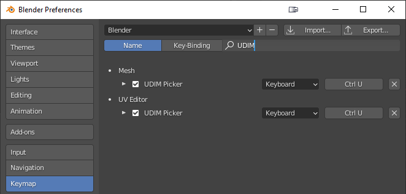
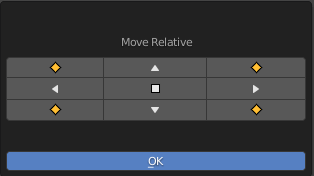
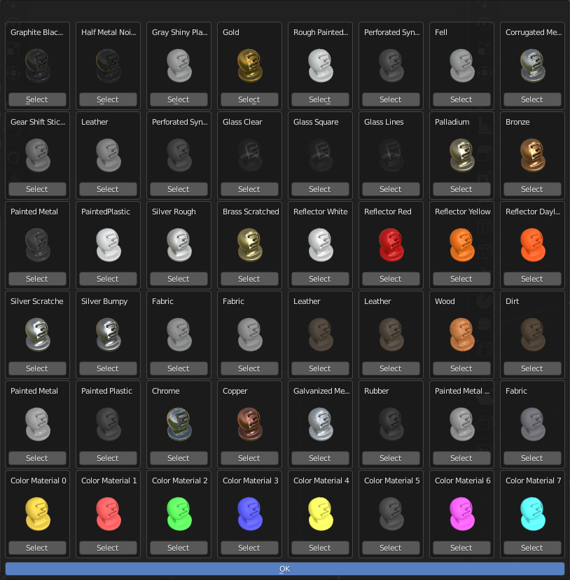

.. _udim_picker:

UDIM-Picker
===========

The UDIM-picker allows you to easily move your uv's between the different UDIM's,
that Giants make available for the shaders, with a visual representation of each material.
It can move your UV's directly to a specific UDIM material or relative to
their current position. It also has easier access for certain UV-related settings.

.. Note:: Currently this is implemented for the 40 UDIM's available for the :class:`vehicleShader`

Shortcut
--------
To access the UDIM-picker press `Ctrl+U`, it will show up as a pie menu.

It is available as a shortcut in both the *UV Editor* and the *3D Viewport* (if it is in *Edit Mode*)

If one wishes to change this default keybinding it can be found in the following two places:

* :menuselection:`Edit --> Preferences --> Keymap --> Image --> UV Editor --> UV Editor (Global) --> UDIM Picker`
* :menuselection:`Edit --> Preferences --> Keymap --> 3D View --> Mesh --> Mesh (Global) --> UDIM Picker`

Or more easily, by searching for "UDIM" in the search field within
:menuselection:`Edit --> Preferences --> Keymap`, which should give you something similar to the following image

    Easiest way to change the shortcut is by searching for "UDIM" in the keymap

Usage
-----
In general the UDIM-Picker has two basic functions. To move your UV's to a specific UDIM-tile or to move them one tile
in a specific direction.

The UDIM-Picker works on faces and will ignore any vertex/edge selected that isn't part of a whole face. This is to make
uv-island detection easier (Blender does not have a built-in function for this) and due to the fact that you only want
to move entire uv-islands around anyway. This isn't to say that you have to be in *face selection mode*, it will work
from any selection mode, you just have to pick at least one entire face worth of vertices/edges for anything to happen.

It is also smart about which UV's you have selected and will divide your selection into separate UV-islands and
move them as if you had selected them individually and moved them around.

This means that you can select UV's from all over your UV-space and have them move into the same UV-tile
(If eg. you changed your mind or want to test out a specific material)
or you can select several UV's all over different tiles and move them relatively one tile to the left
(if you need that for some reason)

What the UV-Picker does not do is to try and place your UV's for you. So it keeps whatever placement you have done, but
simply changes which tile it appears in. So fx. if a uv-vertex is at (0.8,0.65) and you move it to tile (3,5),
your vertex will now be at (3.8,5.65) This also means that if you move several faces that would have overlapped if
placed in the regular UV-tile, they will overlap when moved to the new tile.

.. figure:: udim_picker_pie_uv.png

    The UDIM-Picker as seen in the *UV Editor*, with an extra option for setting it up for UDIM's.

.. Note:: Some form of packing could be implemented in the future, but people use several different addons for this
          and this needs to be accounted for in the implementation

Selection
^^^^^^^^^
The UDIM-Picker works both in the *UV Editor* and in the *3D Viewport*. This means that you can work directly on the
3D-model and select faces, which you can then move to the correct UDIM-material, without interacting with the
*UV Editor*. Although this requires you to enable *UV Sync* in the *UV Editor*, but there is a shortcut for it directly
in the UDIM-Picker menu.

The UDIM-Picker also works without *UV Sync* enabled, but then you have to use the *UV Editor* for selecting your UV's.

.. Hint:: If you enable *UV sync* you can move your UV's around from the *3D Viewport*,
          without going into the *UV Editor*

.. Caution:: If you use the UDIM-Picker in the *3D Viewport* without having a *UV-Editor* window open and *UV sync*
             turned off. Then you won't be able to move around your UV's! The addon will warn you of this in the blender
             log, to hopefully save you some headaches.

Move Relative
^^^^^^^^^^^^^
This mode moves whatever UV's you have selected in the direction that you choose.
The window is draggable and it stays open until you click *OK* or it loses focus. So you can click as many times as you
would like to move your UDIM's into place.

The menu should be pretty self-explanatory, but just to clarify,
the middle square button resets the UDIM's to the (0,0) tile.

    The movement menu for moving the UV's relatively. There is options for up, down, left, right and diagonally plus
    an option to reset the UV's to tile (0,0)

Move to UV-Tile
^^^^^^^^^^^^^^^
In this mode your UV's will be moved to the UDIM-tile specified by the material you select in the menu. The menu shows
you a preview of all the currently available materials and is arranged in the order of the UDIM's themselves
(to hopefully make it easier if you are used to looking them up in a reference sheet)

    The preview menu for moving the UV's to a specific UDIM-tile. The materials are laid out in the same grid as the
    UDIM-tiles themselves for easy referencing.

.. Note:: Thanks to Redphoenix and Wopster for providing the renders of the UDIM materials

UV Editor specific options
^^^^^^^^^^^^^^^^^^^^^^^^^^
When the UDIM-Picker is activated within the *UV Editor* and extra option appears for setting up the *UV Editor* for
working with the UDIM's. Currently the only thing this option does is to resize the UDIM grid, to make it a bit easier
to see where you have placed your UDIM's. Future updates might include extra options.

.. figure:: udim_picker_grid.png

    This grid makes it a bit easier to distinguish where the different UDIM-tiles are and how you have placed your UV's.
    The eight color tiles, would be placed below the bottom row, since blender does not officially support negative
    UDIM-tile indices

Examples
--------

None yet, will provide some examples of basic usage and more creative approaches at some point.